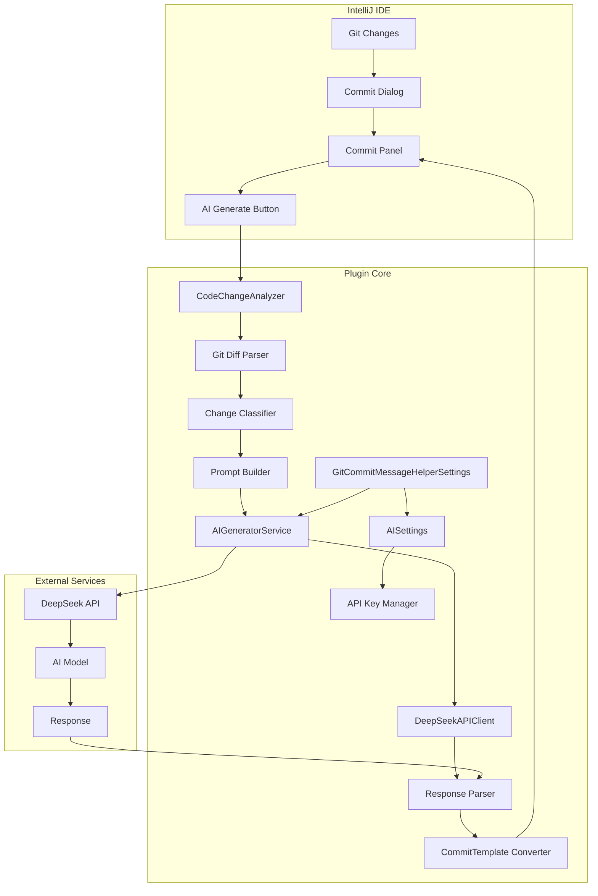
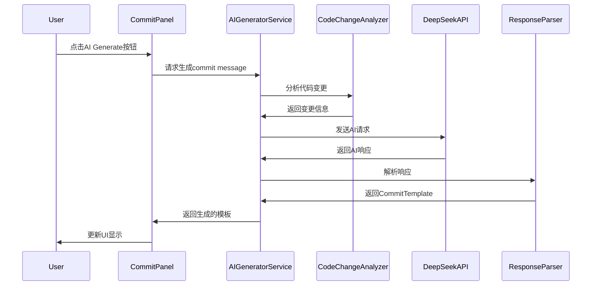
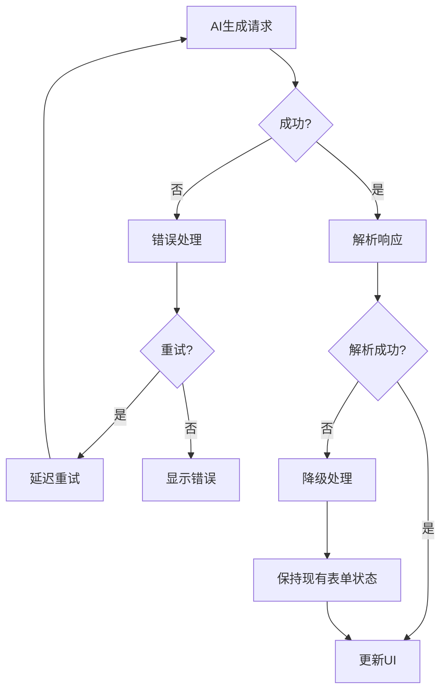

# AI Commit Message 技术架构设计

## 1. 系统架构图



## 2. 核心组件详细设计

### 2.1 代码变更分析模块

#### 2.1.1 CodeChangeAnalyzer
```java
public class CodeChangeAnalyzer {
    private final Project project;
    private final GitRepositoryManager gitManager;

    public CodeChangeInfo analyzeChanges() {
        // 1. 获取Git变更
        List<Change> changes = getGitChanges();

        // 2. 解析文件变更
        List<FileChange> fileChanges = parseFileChanges(changes);

        // 3. 生成diff内容
        String diffContent = generateDiffContent(changes);

        // 4. 分类变更类型
        ChangeType changeType = classifyChangeType(fileChanges);

        // 5. 提取影响范围
        String scope = extractScope(fileChanges);

        return new CodeChangeInfo(fileChanges, diffContent, changeType, scope);
    }

    private List<Change> getGitChanges() {
        // 使用IntelliJ的Git集成API
        return GitUtil.getRepositoryManager(project).getRepositories().stream()
            .flatMap(repo -> repo.getChanges().stream())
            .collect(Collectors.toList());
    }
}
```

#### 2.1.2 变更分类策略
```java
public enum ChangeType {
    FEATURE("feat", "新功能"),
    FIX("fix", "Bug修复"),
    DOCS("docs", "文档更新"),
    STYLE("style", "代码格式"),
    REFACTOR("refactor", "重构"),
    TEST("test", "测试相关"),
    CHORE("chore", "构建/工具");

    private final String type;
    private final String description;
}
```

### 2.2 AI生成服务模块

#### 2.2.1 AIGeneratorService
```java
public class AIGeneratorService {
    private final DeepSeekAPIClient apiClient;
    private final CodeChangeAnalyzer analyzer;
    private final PromptBuilder promptBuilder;
    private final ResponseParser responseParser;

    public CompletableFuture<CommitTemplate> generateCommitMessage(Project project) {
        return CompletableFuture.supplyAsync(() -> {
            // 1. 分析代码变更
            CodeChangeInfo changeInfo = analyzer.analyzeChanges(project);

            // 2. 构建提示词
            String prompt = promptBuilder.buildPrompt(changeInfo);

            // 3. 调用AI API
            String response = apiClient.generateMessage(prompt).get();

            // 4. 解析响应并转换为CommitTemplate
            return responseParser.parseToCommitTemplate(response);
        });
    }
}
```

#### 2.2.2 PromptBuilder
```java
public class PromptBuilder {
    private final AISettings settings;

    public String buildPrompt(CodeChangeInfo changeInfo) {
        StringBuilder prompt = new StringBuilder();

        // 基础指令
        prompt.append("你是一个专业的Git commit message生成助手。");
        prompt.append("请根据以下代码变更信息，生成一个符合Conventional Commits规范的commit message。\n\n");

        // 变更信息
        prompt.append("代码变更信息：\n");
        prompt.append("- 变更文件：").append(formatFileList(changeInfo.getChangedFiles())).append("\n");
        prompt.append("- 变更类型：").append(changeInfo.getChangeType().getDescription()).append("\n");
        prompt.append("- 代码差异：\n").append(changeInfo.getDiffContent()).append("\n");

        // 输出要求
        prompt.append("请生成包含以下部分的commit message：\n");
        prompt.append("1. Type: 提交类型（feat/fix/docs/style/refactor/test/chore）\n");
        prompt.append("2. Scope: 影响范围（可选）\n");
        prompt.append("3. Subject: 简短描述（50字符以内）\n");
        prompt.append("4. Body: 详细描述（可选）\n");
        prompt.append("5. Breaking Changes: 破坏性变更（可选）\n");
        prompt.append("6. Closes: 关闭的Issue（可选）\n\n");

        // 格式要求
        prompt.append("要求：\n");
        prompt.append("- 使用英文\n");
        prompt.append("- 遵循Conventional Commits规范\n");
        prompt.append("- 描述准确、简洁、清晰\n");
        prompt.append("- 如果有破坏性变更，请明确标注\n");
        prompt.append("- 输出格式应与现有模板格式保持一致\n");

        return prompt.toString();
    }
}
```

### 2.3 API客户端模块

#### 2.3.1 DeepSeekAPIClient
```java
public class DeepSeekAPIClient {
    private final AISettings settings;
    private final OkHttpClient httpClient;

    public DeepSeekAPIClient(AISettings settings) {
        this.settings = settings;
        this.httpClient = new OkHttpClient.Builder()
            .connectTimeout(30, TimeUnit.SECONDS)
            .readTimeout(60, TimeUnit.SECONDS)
            .writeTimeout(60, TimeUnit.SECONDS)
            .build();
    }

    public CompletableFuture<String> generateMessage(String prompt) {
        return CompletableFuture.supplyAsync(() -> {
            try {
                // 构建请求
                String requestBody = buildRequestBody(prompt);
                Request request = new Request.Builder()
                    .url(settings.getApiEndpoint())
                    .addHeader("Authorization", "Bearer " + settings.getApiKey())
                    .addHeader("Content-Type", "application/json")
                    .post(RequestBody.create(requestBody, MediaType.get("application/json")))
                    .build();

                // 发送请求
                try (Response response = httpClient.newCall(request).execute()) {
                    if (!response.isSuccessful()) {
                        throw new APIException("API调用失败: " + response.code());
                    }

                    // 解析响应
                    String responseBody = response.body().string();
                    return parseResponse(responseBody);
                }
            } catch (Exception e) {
                throw new CompletionException(e);
            }
        });
    }

    private String buildRequestBody(String prompt) {
        JSONObject request = new JSONObject();
        request.put("model", settings.getModel());
        request.put("messages", Arrays.asList(
            new JSONObject().put("role", "user").put("content", prompt)
        ));
        request.put("max_tokens", settings.getMaxTokens());
        request.put("temperature", settings.getTemperature());

        return request.toString();
    }
}
```

### 2.4 设置管理模块

#### 2.4.1 扩展现有设置
```java
// 扩展现有的GitCommitMessageHelperSettings
public class GitCommitMessageHelperSettings implements PersistentStateComponent<GitCommitMessageHelperSettings> {
    // 现有字段...
    private CentralSettings centralSettings;
    private DataSettings dateSettings;

    // 新增AI设置字段
    private AISettings aiSettings;

    // 现有方法...
    public CentralSettings getCentralSettings() {
        return centralSettings;
    }

    public DataSettings getDateSettings() {
        return dateSettings;
    }

    // 新增AI设置方法
    public AISettings getAISettings() {
        if (aiSettings == null) {
            aiSettings = new AISettings();
        }
        return aiSettings;
    }

    public void setAISettings(AISettings aiSettings) {
        this.aiSettings = aiSettings;
    }
}

// 新增AI设置模型
public class AISettings {
    private String apiKey;
    private String apiEndpoint = "https://api.deepseek.com/v1/chat/completions";
    private String model = "deepseek-chat";
    private int maxTokens = 500;
    private double temperature = 0.7;
    private boolean enabled = false;
    private boolean autoGenerate = false;

    // getters and setters
}
```

### 2.5 UI组件模块

#### 2.5.1 扩展现有CommitPanel
```java
// 在现有的CommitPanel中添加AI功能
public class CommitPanel {
    // 现有字段...
    private JComboBox<TypeAlias> changeType;
    private JTextField changeScope;
    private JTextField shortDescription;
    private EditorTextField longDescription;
    private EditorTextField breakingChanges;
    private JTextField closedIssues;

    // 新增AI相关字段
    private JButton aiGenerateButton;
    private JLabel aiStatusLabel;
    private AIGeneratorService aiGeneratorService;

    public CommitPanel(Project project, GitCommitMessageHelperSettings settings, CommitTemplate commitMessageTemplate) {
        this.settings = settings;

        // 现有初始化代码...
        initExistingComponents();

        // 初始化AI功能
        if (settings.getAISettings().isEnabled()) {
            initAIFeatures(project);
        }
    }

    private void initAIFeatures(Project project) {
        // 初始化AI按钮
        aiGenerateButton = new JButton("🤖 AI Generate");
        aiGenerateButton.setToolTipText("Generate commit message with AI");

        // 初始化状态标签
        aiStatusLabel = new JLabel("Ready");
        aiStatusLabel.setForeground(Color.GRAY);

        // 初始化AI服务
        aiGeneratorService = new AIGeneratorService(settings.getAISettings());

        // 设置事件处理
        aiGenerateButton.addActionListener(e -> generateWithAI(project));

        // 添加到UI布局
        addAIToLayout();
    }

    private void generateWithAI(Project project) {
        // 禁用按钮，显示加载状态
        aiGenerateButton.setEnabled(false);
        aiStatusLabel.setText("Generating...");
        aiStatusLabel.setForeground(Color.BLUE);

        // 异步生成
        aiGeneratorService.generateCommitMessage(project)
            .thenAccept(this::updateCommitTemplate)
            .exceptionally(this::handleAIError)
            .thenRun(() -> {
                // 恢复按钮状态
                aiGenerateButton.setEnabled(true);
                aiStatusLabel.setText("Ready");
                aiStatusLabel.setForeground(Color.GRAY);
            });
    }

    private void updateCommitTemplate(CommitTemplate template) {
        // 更新现有表单字段
        if (template.getType() != null) {
            setSelectedType(template.getType());
        }
        if (template.getScope() != null) {
            changeScope.setText(template.getScope());
        }
        if (template.getSubject() != null) {
            shortDescription.setText(template.getSubject());
        }
        if (template.getBody() != null) {
            longDescription.setText(template.getBody());
        }
        if (template.getChanges() != null) {
            breakingChanges.setText(template.getChanges());
        }
        if (template.getCloses() != null) {
            closedIssues.setText(template.getCloses());
        }

        // 更新状态
        aiStatusLabel.setText("Generated successfully");
        aiStatusLabel.setForeground(Color.GREEN);
    }

    private Void handleAIError(Throwable error) {
        // 处理AI生成错误
        aiStatusLabel.setText("Generation failed: " + error.getMessage());
        aiStatusLabel.setForeground(Color.RED);

        // 显示错误对话框
        SwingUtilities.invokeLater(() -> {
            JOptionPane.showMessageDialog(
                mainPanel,
                "AI generation failed: " + error.getMessage(),
                "AI Generation Error",
                JOptionPane.ERROR_MESSAGE
            );
        });

        return null;
    }
}
```

#### 2.5.2 扩展现有设置界面
```java
// 在现有的CentralSettingConfigurable中添加AI设置
public class CentralSettingConfigurable implements SearchableConfigurable {
    private CentralSettingPanel centralSettingPanel;
    private AISettingsPanel aiSettingsPanel; // 新增
    private JTabbedPane tabbedPane; // 新增

    @Override
    public JComponent createComponent() {
        if (tabbedPane == null) {
            tabbedPane = new JTabbedPane();

            // 现有设置面板
            if (centralSettingPanel == null) {
                centralSettingPanel = new CentralSettingPanel(settings);
            }
            tabbedPane.addTab("General", centralSettingPanel.getMainPanel());

            // 新增AI设置面板
            if (aiSettingsPanel == null) {
                aiSettingsPanel = new AISettingsPanel(settings);
            }
            tabbedPane.addTab("AI Settings", aiSettingsPanel.getMainPanel());
        }
        return tabbedPane;
    }

    @Override
    public void apply() {
        // 应用现有设置
        settings.setCentralSettings(centralSettingPanel.getSettings().getCentralSettings());

        // 应用AI设置
        if (aiSettingsPanel != null) {
            settings.setAISettings(aiSettingsPanel.getSettings());
        }

        settings = centralSettingPanel.getSettings().clone();
    }
}

// 新增AI设置面板
public class AISettingsPanel {
    private JPanel mainPanel;
    private JTextField apiKeyField;
    private JTextField endpointField;
    private JComboBox<String> modelComboBox;
    private JSpinner maxTokensSpinner;
    private JSpinner temperatureSpinner;
    private JCheckBox enabledCheckBox;
    private JCheckBox autoGenerateCheckBox;
    private JButton testConnectionButton;

    public AISettingsPanel(GitCommitMessageHelperSettings settings) {
        initComponents();
        loadSettings(settings.getAISettings());
        setupEventHandlers();
    }

    private void initComponents() {
        // 初始化UI组件
        mainPanel = new JPanel(new BorderLayout());

        // API配置面板
        JPanel apiPanel = new JPanel(new GridBagLayout());
        apiPanel.setBorder(BorderFactory.createTitledBorder("API Configuration"));

        // 添加API配置字段
        addApiConfigFields(apiPanel);

        // 生成配置面板
        JPanel generationPanel = new JPanel(new GridBagLayout());
        generationPanel.setBorder(BorderFactory.createTitledBorder("Generation Settings"));

        // 添加生成配置字段
        addGenerationConfigFields(generationPanel);

        // 按钮面板
        JPanel buttonPanel = new JPanel(new FlowLayout(FlowLayout.RIGHT));
        buttonPanel.add(testConnectionButton);

        // 组装主面板
        mainPanel.add(apiPanel, BorderLayout.NORTH);
        mainPanel.add(generationPanel, BorderLayout.CENTER);
        mainPanel.add(buttonPanel, BorderLayout.SOUTH);
    }

    private void setupEventHandlers() {
        testConnectionButton.addActionListener(e -> testConnection());
        enabledCheckBox.addActionListener(e -> updateUIState());
    }

    private void testConnection() {
        // 测试API连接
        testConnectionButton.setEnabled(false);
        testConnectionButton.setText("Testing...");

        AISettings testSettings = getSettings();
        DeepSeekAPIClient client = new DeepSeekAPIClient(testSettings);

        client.testConnection()
            .thenAccept(success -> {
                SwingUtilities.invokeLater(() -> {
                    testConnectionButton.setEnabled(true);
                    if (success) {
                        testConnectionButton.setText("Connection OK");
                        JOptionPane.showMessageDialog(mainPanel, "Connection successful!", "Test Connection", JOptionPane.INFORMATION_MESSAGE);
                    } else {
                        testConnectionButton.setText("Connection Failed");
                        JOptionPane.showMessageDialog(mainPanel, "Connection failed. Please check your API key and endpoint.", "Test Connection", JOptionPane.ERROR_MESSAGE);
                    }
                });
            })
            .exceptionally(error -> {
                SwingUtilities.invokeLater(() -> {
                    testConnectionButton.setEnabled(true);
                    testConnectionButton.setText("Connection Failed");
                    JOptionPane.showMessageDialog(mainPanel, "Connection failed: " + error.getMessage(), "Test Connection", JOptionPane.ERROR_MESSAGE);
                });
                return null;
            });
    }
}
```

## 3. 数据流设计

### 3.1 主要数据流


### 3.2 错误处理流程


## 4. 配置管理

### 4.1 设置存储结构
```xml
<application>
    <component name="GitCommitMessageHelperSettings">
        <!-- 现有配置 -->
        <option name="centralSettings">
            <CentralSettings>
                <!-- 现有中央设置 -->
            </CentralSettings>
        </option>
        <option name="dateSettings">
            <DataSettings>
                <!-- 现有数据设置 -->
            </DataSettings>
        </option>
        <!-- 新增AI设置 -->
        <option name="aiSettings">
            <AISettings>
                <option name="apiKey" value="encrypted_key" />
                <option name="apiEndpoint" value="https://api.deepseek.com/v1/chat/completions" />
                <option name="model" value="deepseek-chat" />
                <option name="maxTokens" value="500" />
                <option name="temperature" value="0.7" />
                <option name="enabled" value="false" />
                <option name="autoGenerate" value="false" />
            </AISettings>
        </option>
    </component>
</application>
```

### 4.2 项目级配置
```xml
<project>
    <component name="ProjectAISettings">
        <option name="projectSpecificSettings" value="false" />
        <option name="customPrompt" value="" />
        <option name="excludePatterns" value="*.log,*.tmp" />
    </component>
</project>
```

## 5. 性能优化策略

### 5.1 缓存机制
- **提示词缓存**: 缓存常用的提示词模板
- **响应缓存**: 缓存相似的代码变更的AI响应
- **设置缓存**: 缓存用户设置，避免重复读取

### 5.2 异步处理
- **非阻塞UI**: 所有AI操作都在后台线程执行
- **进度反馈**: 实时显示生成进度
- **取消支持**: 支持用户取消正在进行的生成

### 5.3 资源管理
- **连接池**: 复用HTTP连接
- **超时控制**: 设置合理的请求超时时间
- **频率限制**: 限制API调用频率，避免超出限制

## 6. 安全设计

### 6.1 数据保护
```java
public class SecureStorage {
    private static final String ENCRYPTION_KEY = "git_commit_helper_ai_key";

    public static String encrypt(String data) {
        // 使用AES加密敏感数据
        return AESUtil.encrypt(data, ENCRYPTION_KEY);
    }

    public static String decrypt(String encryptedData) {
        // 解密敏感数据
        return AESUtil.decrypt(encryptedData, ENCRYPTION_KEY);
    }
}
```

### 6.2 隐私保护
- **本地处理**: 代码变更信息在本地分析
- **选择性上传**: 用户可选择是否上传代码内容
- **数据清理**: 定期清理临时数据和历史记录

## 7. 测试架构

### 7.1 单元测试结构
```
src/test/java/
├── com.fulinlin.ai/
│   ├── service/
│   │   ├── AIGeneratorServiceTest.java
│   │   └── CodeChangeAnalyzerTest.java
│   ├── client/
│   │   └── DeepSeekAPIClientTest.java
│   ├── parser/
│   │   └── ResponseParserTest.java
│   └── ui/
│       └── AISettingsPanelTest.java
```

### 7.2 集成测试
```java
@Test
public void testEndToEndGeneration() {
    // 模拟代码变更
    CodeChangeInfo changeInfo = createMockChangeInfo();

    // 测试完整流程
    AIGeneratorService service = new AIGeneratorService(mockSettings);
    CompletableFuture<CommitTemplate> future = service.generateCommitMessage(project);

    CommitTemplate result = future.get(10, TimeUnit.SECONDS);

    // 验证结果
    assertNotNull(result);
    assertNotNull(result.getType());
    assertNotNull(result.getSubject());
}
```

## 8. 部署和发布

### 8.1 构建配置
```gradle
// 在build.gradle中添加AI相关依赖
dependencies {
    implementation 'com.squareup.okhttp3:okhttp:4.9.3'
    implementation 'org.json:json:20210307'
    implementation 'org.apache.commons:commons-text:1.11.0'

    testImplementation 'org.mockito:mockito-core:4.5.1'
    testImplementation 'org.junit.jupiter:junit-jupiter:5.8.2'
}
```

### 8.2 插件配置
```xml
<!-- 在plugin.xml中注册AI相关组件 -->
<extensions defaultExtensionNs="com.intellij">
    <!-- 现有组件保持不变 -->
    <applicationService serviceImplementation="com.fulinlin.storage.GitCommitMessageHelperSettings"/>

    <!-- 新增AI相关组件 -->
    <applicationService serviceImplementation="com.fulinlin.ai.storage.AISettingsManager"/>
</extensions>
```

---

**文档版本**: v2.0
**创建日期**: 2024年12月
**更新日期**: 2024年12月
**技术负责人**: 开发团队